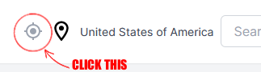

This is a [Next.js](https://nextjs.org/) project bootstrapped with [`create-next-app`](https://github.com/vercel/next.js/tree/canary/packages/create-next-app).

# Next.js Weather App

This project was an exercise in developing using Next.js, Typescript, and Tailwind CSS, and managing global state with [Jotai](https://github.com/pmndrs/jotai). The app features a dynamic display of the user's forecast, and location can be set to anywhere on the globe!


Main screen shows users a detailed forecast for the next day, as well as an overview of the weekly forecast. Weather details displayed include air pressure, wind speed, visibility, humidity, sunrise, and sunset. (Disclaimer: all units of measurement are listed in US metrics) All weather data is fetched to [OpenWeatherMap's open-source API](https://openweathermap.org/).

## App location

- The app's location state defaults to `United States of America`


### Changing location

There are two easy ways to set the app's location to something else:

1. Current location button -



- press this button to set the app's location to your browser's geolocation.

2. Search -


- type in the location name of where you would like to view weather from, and OpenWeatherMap's API will return a list of valid locations to select from
- select a location from the suggestions, and hit search!


## Installation

First, fork and clone this repository.

Then navigate to your cloned project, and install dependencies:

```bash
npm install
# or
yarn install
# or
pnpm install
#or
bun install
```

Then, run the development server:

```bash
npm run dev
# or
yarn dev
# or
pnpm dev
# or
bun dev
```

Open [http://localhost:3000](http://localhost:3000) with your browser to see the result.

## Dev Notes/Plans

If anyone would be interested, I'm thinking about adding the ability to toggle between a light and dark mode for users, as well as implementing a user account system to set the default location to where the user has listed as their home location, and save favorite locations to easily toggle between them!

Let me know what you want to see!

## Tech Stack

- Next.js 14
- React
- Typescript
- Tailwind CSS
- [OpenWeatherMap API](https://openweathermap.org/)
- [React Icons](https://github.com/react-icons/react-icons)
- [Tanstack Query](https://github.com/TanStack/query)
- [date-fns](https://github.com/date-fns/date-fns)
- [jotai](https://github.com/pmndrs/jotai)
- [axios](https://github.com/axios/axios)
- [clsx](https://github.com/lukeed/clsx)
